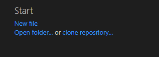
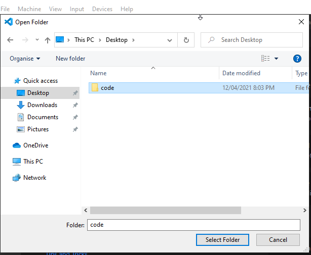
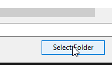
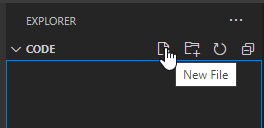
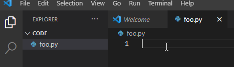
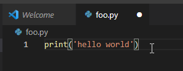
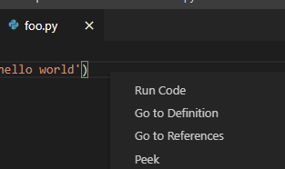
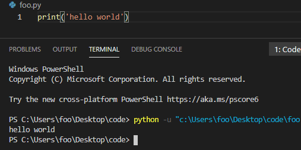

# Visual Studio Code (VSC)

## You will learn
* How to create a workspace in VSC
* How to create a file (python) in VSC
* How to save and execute python files in visual studio code
* Know how to create new and maintain files in VSC
* Understand what VSC is and how it relates to Google Colab

## Using Visual Studio Code (VSC) to create new and maintain existing files

### Creating a workspace in Visual Studio Code

Before we start programming, we need to configure your working directory. I'd recommend that you choose the same directory over and over again. Preferably, something on your h: drive so you can guarantee that it will always be available. 

On your home page in VSC, you can click `open folder`.   


There, navigate to wherever your directory is. If you need to create it, you can right-click on the screen and make it.   


When ready, press select folder


### Creating a python file in visual studio code
Visual Studio Code should have opened up in a file mode with whatever your workspace was called. Mine was called code. 

To the right of code, I have four images. I'm going to make a new file, so I'm going to click it. Make a new python file. I called my foo.py. 


If it doesn't automatically open, double click on it in the file view. It should be empty. 


Let's write a simple program to test that everything is working. 


### How to save and execute a file in visual studio code
The white dot to the left of foo.py indicates that the file hasn't been saved. We can save this by pressing `control+s`


To execute the program, right-click and select run code


You know it works when it outputs hello world into your terminal window. 


### What is Visual Studio Code?
Visual Studio Code is a freeware source-code editor made by Microsoft for Windows, Linux and macOS. Features include support for debugging, syntax highlighting, intelligent code completion, snippets, code refactoring, and embedded Git.

### Why VSC and not Colab?
Colab is a fine notepad development platform. However, it lacks the expressiveness and flexibility of VSC. 

## Challenges
To help establish your understanding of using visual studio code, let's do some challenges. 
### Basic Challenge
Create a new directory called `Week 10`
Create a new python file in  `Week 10` called `find_largest_number.py` and paste the code following this challenge into it
Write some code to find the largest number in the list numbers

```python
from random import randint
numbers = []
count = 0
while count < 10_000:
    numbers.append(randint(1, 1_000_000))
    count += 1
```