# Using the Debugger 

## You will learn
* How to Run and Debug a file
* How to save basic configurations
* How to use a breakpoint to stop a program
* How to monitor program variables 
* How to watch variables
* What Continue does
* What step over does
* What step into does
* What step out does
* What restart does
* What stop does
* Understand how to use the debugger to work through a program

## Using a debugger  

Before we do anything. Copy this code (it's a kind of an answer from the last challenge) into your week 10 directory and call it `debugging_large_numbers.py`

```python
from random import randint

numbers = []
count = 0
while count < 10:
    numbers.append(randint(1, 1_000_000))
    count += 1

biggest_number_so_far = -1
for number in numbers:
    if number > biggest_number_so_far:
        biggest_number_so_far = number
print(biggest_number_so_far)
```

### Run and Debug
Let's debug this code to see how it works. On the left-hand side of Visual Studio Code, there are some icons run down the page. Click the debugging icon: 


This will change your side window to the debugging window. It should look a little bit like this: 

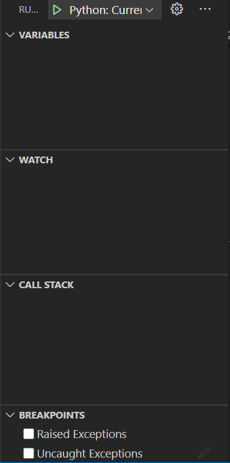

To make things easier in the future, click the down arrow at the top and select `current file`
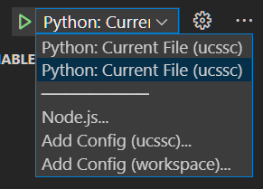

Press the green button!

Okay, it ran but it didn't seem useful. We need to stop the program. 

### Pausing a program at some midpoint with breakpoints. 

Hover the mouse to the side of the file (to the left of the line number) you should see a red circle appear. Click it: 

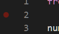

I chose line 2, but you could pick 1 2 or 3. 

Press the green triangle/arrow again. You should now see something like this: 
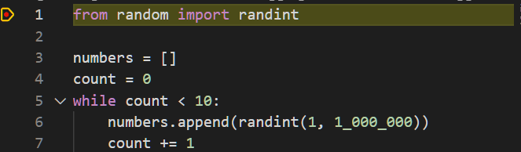 

In my case, it moved up to line 1 because there is no text on line 2. We can clearly see a yellow widget around my red dot and the yellow highlight to show us where the program got to. 

Now, look at the left of the window. Check out the local variables section of the debugger window. 

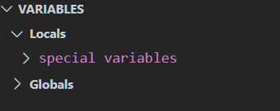

Open up the special variables and have a bit of an explore. 

Variables with written like `__foo__` are special variables that are meant to be semi-private. These are the structures that live inside python. 

### Stepping through code 

At the middle-top of the window, you will see 6 icons. I want you to click the down arrow (step into). 
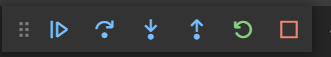

Because I started on line 1 and I have now stepped to line 3 (because there is nothing on line 2) I have a new function variable in my variable list: 
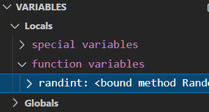

We've just imported randint into this program and the debugger shows that. 

Press step into again. 

We've just added the numbers list to our list of local variables. 

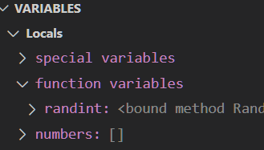

Click the step into button a few more times. Write down (maybe in a comment) at least 2 things that are changing each time you go around the while loop. 

### Restarting the debugger

If you need to restart the debugger so you can see stuff happen again, press the circle back button. 

### Stopping the debugger
Press the stop (the square button)

### Continuing to the next break point
That was pretty useful but what happens if you want to check things in different spaces and your program does a lot of things. Like this change to my code: 

```python
from random import randint

numbers = []
count = 0
while count < 10_000:
    numbers.append(randint(1, 1_000_000))
    count += 1

biggest_number_so_far = -1
for number in numbers:
    if number > biggest_number_so_far:
        biggest_number_so_far = number
print(biggest_number_so_far)
```

I'm going to add some break points: 
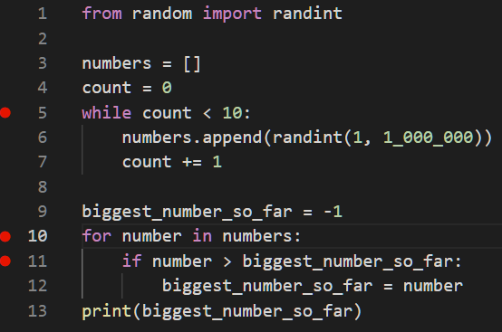

Debug your program. Click the step in button a few times. 

Okay, we've stepped through this program a few times and we know what it is doing. How do we stop stuffing in this while loop? Right click on the breakpoint and disable it. 
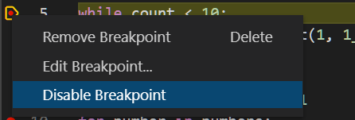

Press continue


Right, now we've moved all the way down to line 10. In fact, we can also see some details on the left. 

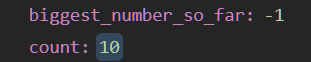

We can see that the while loop only got to `10`, which we told it to do. Now that count is just hanging out there—something to keep in mind. 

We can also see that I've prepped to start finding the largest number in my list. There are more efficient ways to solving this problem (`max()`) but loops help show off the debugger. 

Let's step in. 

Hover over `number` and then `biggest_number_so_far` and compare them to the variables in the left hand side of the window. 

In my case, `number was 87327` and `biggest_number_so_far was -1` so in this case, the condition is true. Let's step into the if statement and then step into again. We can now see that the 
`biggest_number_so_far` has been modified so it is `87327`. 

### Editing Variables

In my case my second number was `169,505` and I really want it to be smaller than `87,327` for demonstration purposes. So, I'm just going to edit that here. I going to open up numbers, and find numbers[1] and change it to 1. 

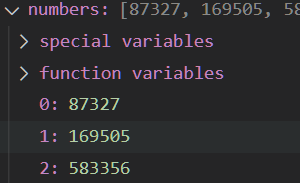

Double click: 

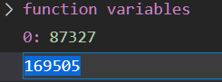

Put in 1 and press enter


Step into: 

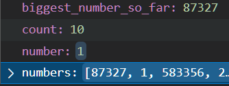

Now my number is `1` but the biggest number is `87,327`. Let's step in. Notice how we didn't slip into the if statement? 


### Watching variables

You might be wondering, that is a lot of things to keep track of in the variables list. You're right. We can highlight some with the watch section. 

Hover over the watch field and you should be able to see a + button. 

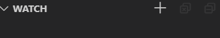

Click it and enter a variable. I entered biggest_number_so_far

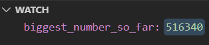

Oh, you can also do cool things with watched variables: 

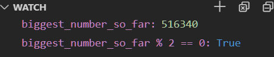
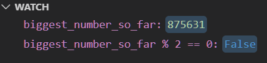

In these two cases, I made a condition that tells me if the largest number is even or not. 

### Stepping into, over, and out of a code block

So, what does step into, step over, step out, mean? 

Make a new file in week 10 called "fizz_buzz.py" and put the following code into it

```python
def fizz_buzz(number, a=3, b=5):
    if number % a == 0 and number % b == 0:
        return 'fizzbuzz'
    elif number % a == 0:
        return "fizz"
    elif number % b == 0:
        return "buzz"
    else: 
        return number

for i in range(1, 16):
    print(fizz_buzz(i))
```

Put a break point on line 12 `print(fizz_buzz(i))` then start the debugger. 

Press step into: 
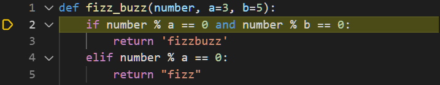

You step into the function fizz_buzz

Press step out: 

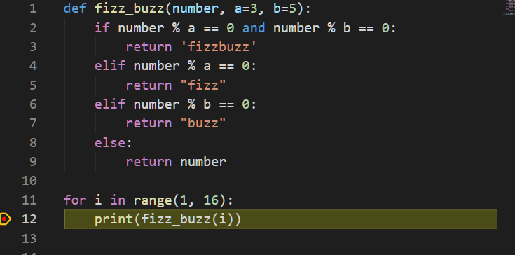
We execute the function and step out

Press step over: 

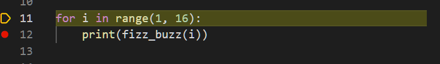

The function executes without us stepping into it but the program keeps stepping through logic (not going into functions)

Press continue: 
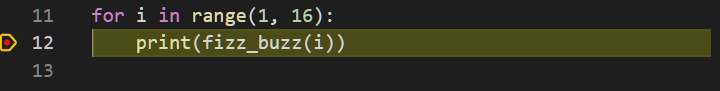

The program just executes until the next break point. 


## Challenges

### Intermediate Challenges

Debug the following code: 
```python
def make_galaxy(name, distance, galaxy_type):
    distance = f'{distance} Million Light Years'

    if galaxy_type == 'S':
        galaxy_type == 'Spiral'
        name = '{name} galaxy'
    elif galaxy_type == "E":
        galaxy_type == "Elliptical"
        name = f'{name} Galaxy'
    elif galaxy_type == "I":
        galaxy_type == "Irregular"
    elif galaxy_type == 'L':
        galaxy_type == "Lenticular"
        name = f'{name} galaxy'
    
    return (name, distance, galaxy_type)

galaxies = []

galaxies.append(make_galaxy("Tadpole", 400, 'S'))
galaxies.append(make_galaxy('Pinwheel', 25, 'S'))
galaxies.append(make_galaxy('Cartwheel', 500, 'L'))
galaxies.append(make_galaxy('Andromeda', 3, 'S'))
galaxies.append(make_galaxy('Maffei 1', 11, 'E'))
galaxies.append(make_galaxy('Small Magellanic Cloud', 0.2, 'I'))

for galaxy in galaxies:
    name = galaxy[0]
    distance = galaxy[1]
    galaxy_type = galaxy[2]
    print(f'Hey, did you know that the {name} {distance} {galaxy_type}')
```