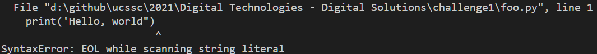

# Printing text

## Goals: 


*   Know how to use python to print strings and variables to the console line
*   Know how to manipulate strings at a basic level

## Worked Examples: 

### Simple printing

Every programmer starts with writing stuff to console. It's a common way to log errors, a common (but not ideal) way to debug code, and most importantly for us, it's pretty simple. 

#### What's a string? 

A string is a special attribute/variable in Python (and programming in general). It stores a group of characters together. You'll be pretty familiar with them really. 

#### Printing a single string  

So, how we do print a string to console. Well, in python it's super easy. You type: `print("put string in here")`

```python
print("Hello, world")
> Hello, world
```

Unlike other languages you can use either double quotes `"` or single quotes `'` but you can't use backtick (`)

```python
print('Hello, world')
> Hello, world
```

However, you must use the same quotes for a string. Otherwise you break python. 

```python
print('Hello, world")
```


**practice**

* Make a little story in python. Tell us: 
  * What your name is
  * How old you are
  * what you are most looking forward to at school.  

#### Concatenating Strings

Sometimes you will be faced with multiple strings and you'll be required to shove them into being a single string. The following technique is called concatenating. I used to leave this out but last year we found some really tasty edge cases where they appeared. 

Notice however, that the concatenation is literal. If you need a space between words you are responsible for telling python. 

```python
print("Ada" + "Lovelace")
print("Ada" + " " + "Lovelace")
print("Ada " + "Lovelace")
print("Ada" + " Lovelace")
> AdaLovelace
> Ada Lovelace
> Ada Lovelace
> Ada Lovelace
```
**practice**

Try using concatenate with your name. Try it with different ways of putting space in. 

#### Printing multiple strings:  

I find that a lot of the time I don't really care about concatenating. Instead I use one of two other methods. One of them I will teach later on this week `f-strings`, but the other is using the print function to print multiple strings. 

```python
print("Hello", "world")
> Hello world
```

**practice**

Make a computer program to do this with your own name. Try something with three, four, or even five strings!

### using escape characters

There are special characters in python that tell the command prompt how to format some text. There is a lot more than what I am going to show you (so you might want to read the docs) but I'll show you some important ones. 

[Escape sequences can be found here](https://docs.python.org/3.9/reference/lexical_analysis.html#index-16)
#### escape

Sometimes we are going to be forced to use a quote that we've opened a string up with. 

We could fix the first example by switching the string quotes from `'` to `"` or we could just put a backslash in front of the apostrophe. 

The second scenario is more common. We've got an apostrophe and we want to "quote" someone. We have two choices, we could use `'` to define the string, and backslash the apostrophe or we could backslash the `"` around the quotes. 

```python
print('It\'s great')
print("It's great, but what if you have to \"quote\" someone?")
print('Sometimes we need to type backslash \\')
```
```
> It's great
> It's great, but what if you have to "quote" someone?
> Sometimes we need to type backslash \
```

**practice**

Fix the following code blocks: 

```python
print('Tom's tempting tongue twisters truly tangled my tongue.')
print("Nelson Mandella said - "The greatest glory in living lies not in never falling, but in rising every time we fall."")
```

#### new line

Sometimes, apparently, you'll be required to force a string into adding new lines. Python has this capacity by `\n`. However, be careful because if you add erroneous spaces in here they will get rendered in place. 

```python
print("Ada\nBob\nCharlie")
> Ada
> Bob
> Charlie
```

**practice**

Transform the following print statement so it prints everything on it's own line: 

```python
print("Famous dudes: Nelson Mandela Walt Disney Steve Jobs Eleanor Roosevelt Ada Lovelace")
```

You want it to look like this: 
```
> Famous dudes:
> Nelson Mandela
> Walt Disney
> Steve Jobs
> Eleanor Roosevelt
> Ada Lovelace
```

#### tab

A more common scenario is that you need to get some consistent spacing between strings. We can use the old school tab to generate some space. Tab generates spaces to the next tab block (4 characters by default). So you can push things to approximately align. 
```python
print("hello\tworld")
> hello   world
```

**practice**

Using the same list of people above, separate their names with tab fields so we get an equal spacing between them. 

```
> Nelson        Mandela
> Walt          Disney
> Steve         Jobs
> Eleanor       Roosevelt
> Ada           Lovelace
```

Why do Nelson Mandela and Eleanor Roosevelt need a different number of tabs than say Ada Lovelace? 

### String Formatting

#### Title case

```python
print("ada bob and charlie".title())
> Ada Bob And Charlie
```
#### Upper case

```python
print("Ada Bob and Charlie".upper())
> ADA BOB AND CHARLIE
```
#### lower case

```python
print("Ada Bob and Charlie".lower())
```
```
> ada bob and charlie
```

#### Capitalise sentence

```python
print("Ada Bob and Charlie".capitalize())
```
```
> Ada bob and charlie
```

**practice**

Change the following statement so it has the same output as this: 

```python
print("Walt Disney", "Steve Jobs", "Eleanor Roosevelt", "ada lovelace")
```
```
> WALT DISNEY steve jobs Eleanor roosevelt Ada Lovelace
```

### Removing whitespace

```python
print("        Ada Bob and Charlie".lstrip())
```
```
> Ada Bob and Charlie
```

```python
print("Ada Bob and Charlie            ".rstrip())
```
```
> Ada Bob and Charlie
```


```python
print("    Ada Bob and Charlie    ".strip())
```
```
> Ada Bob and Charlie
```
**practice**

Repeat the examples given here. 

