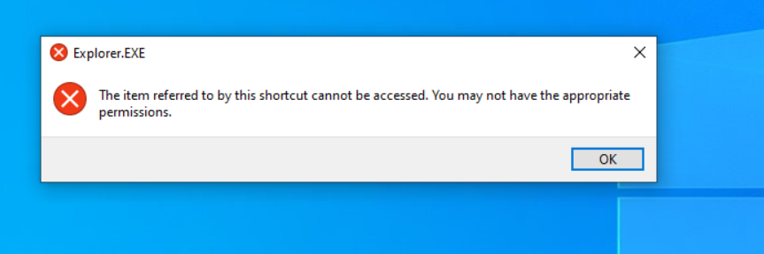
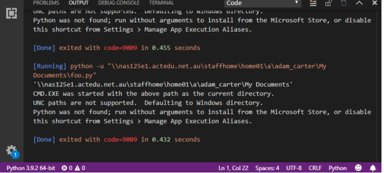
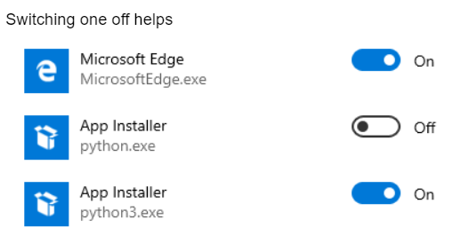
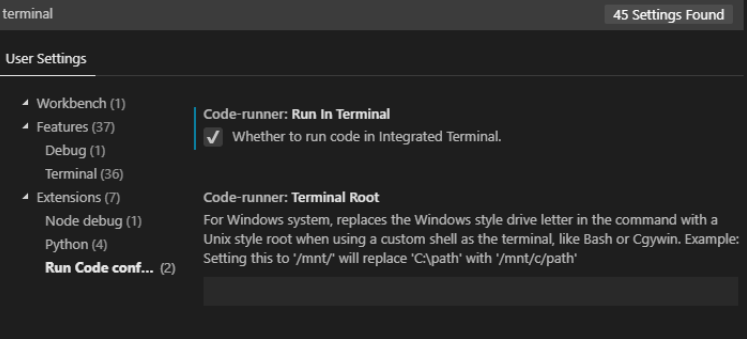
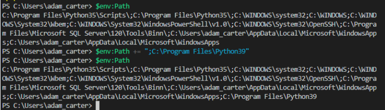
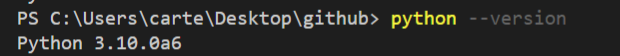
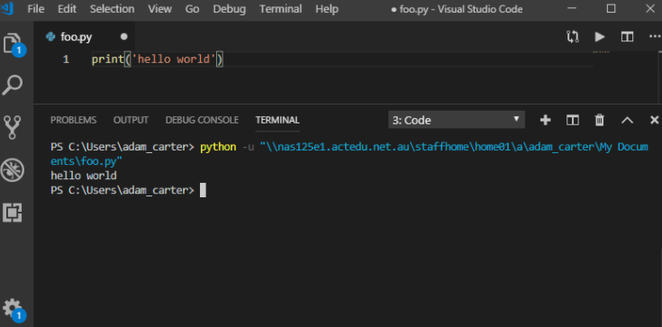

# Debugging Visual Studio Code

## You will learn how to debug what your problem is on Visual Studio Code
The configuration file for Visual Studio Code is currently misconfigured, requiring a considerable amount, requiring a lot of massaging to fix. If you have a personal computer (that isn't a Chromebook), now would be a good time to bring it in.  If only to save our collective sanity until this fixed. 

In the meantime, I have created this process to solve as many problems as I can. 

## **Misconfigurations** 

### You do not have appropriate permissions to use Visual Studio Code
**Problem**: You can see Visual Studio Code but when you click on it you get the following error message: 

**Immediate Solution**: Sign out and summon me. I need to uninstall Visual Studio Code and reinstall it. 

**Intermediate Solution**: Until they fix the problem, it might be easier to distribute ourselves around the classroom, so we aren't using/overlapping on the computers. 

### **Visual Studio Code loads, but when I attempt to run a python file I get an error talking about changing the Manage App Execution Aliases**. 

**Problem**: When you attempt to execute Python, you receive an error message saying that it can't run Python, and it specifically mentions the Manage App Execution Aliases feature. 

**Immediate Solution**: Press the Windows Button -> Type "Manage App Execution" and turn off App Installer for Python.exe. 
 
 

### **Python is not recognised as an Internal or External Command**

**Problem**: You execute Python, and you get an error saying that Windows doesn't know what Python is. 

**Immediate Solution**: 
* Switch to Terminal Mode: `Press f1 -> type terminal -> click on Run Code Configuration`

* Type `$env:Path += ';C:\Program Files\Python39'`

* type `python --version`

* Retry running your python script

