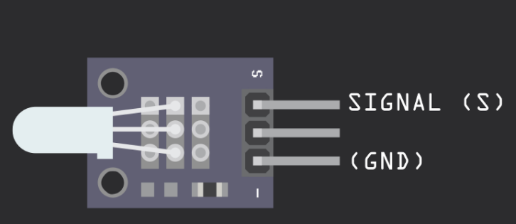
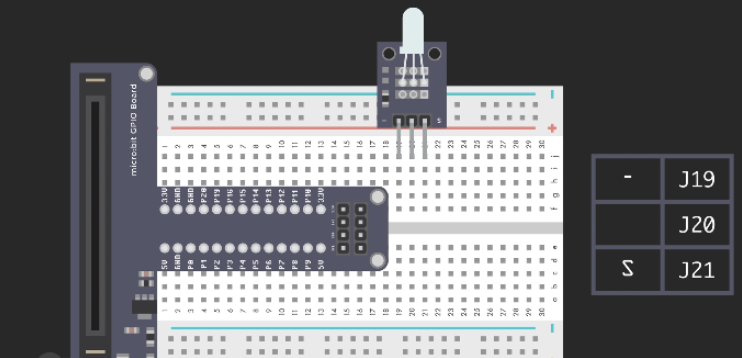
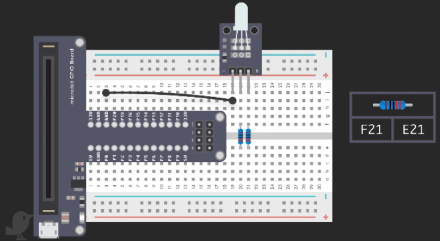
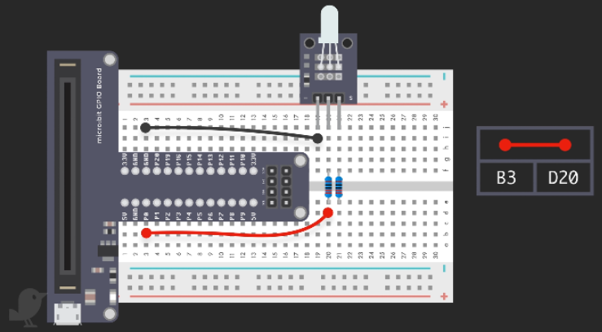
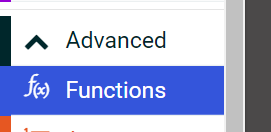
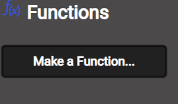
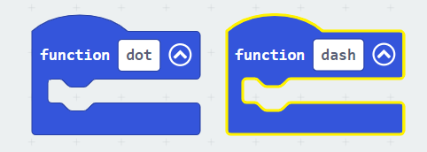
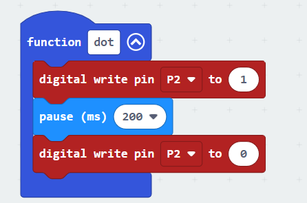
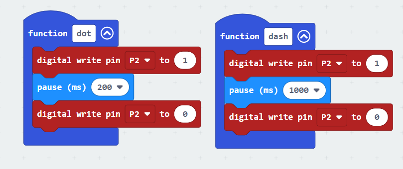
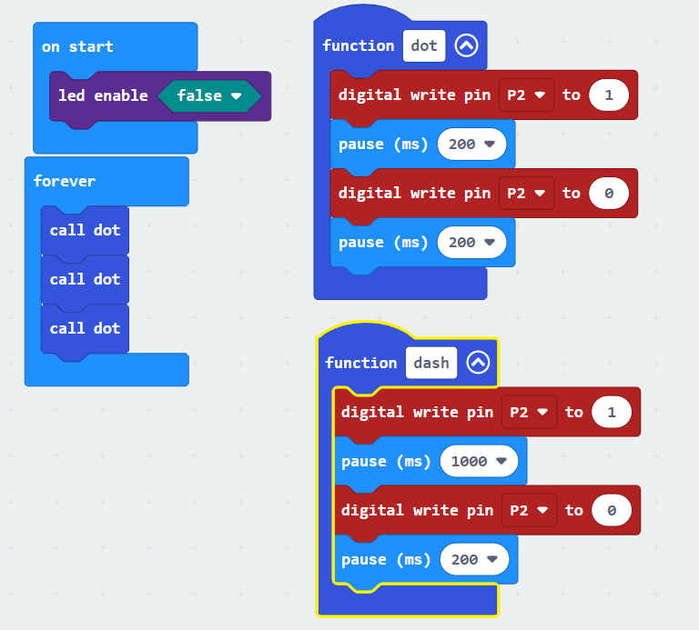

# Making Morse Code player

## You will learn
* How to use the LED light
* How to create a function wto 
## Topic 

### Making a light
Select the 2 colour LED: 

Plug it into the board leaving enough space for jump leads to be plugged into the front and the back of the LED. 

Place in your LED. Remembering that the pin on the left needs to go to ground. 

Put two resisters in the second and third pins

Connect power up to one of the pins (it doesn't matter which one. )

Let's make some functions. 

We are going to make two functions. dit and dot. Both functions will flash a light for some time. dit flash will be for 200ms and dot flash will be for 1000ms

Remembering that dit function turns a light on for 200ms and then turns it off. We can write the blocks in to allow that.

Before you scroll down to to the next section. See if you can write your own dot function (pausing for 1000 ms)

Setting up the dash function is pretty easy. 

Finally, let's make morse code type a letter. In this case we are going to write the letter s.

## Challenges

Challenges are used to help refine your understanding and knowledge of a topic. 

###  Challenge

In this challenge, you are asked to write your name in Morse code. 

There are two things you need to know to complete this. The combinations of dits and dots to make letters. 
https://en.wikipedia.org/wiki/Morse_code

The second thing, is you will need to create two new functions to define the space between letters and words. 

Spaces between letters is 200ms
Spaces between words is 7000ms