# Printing (to LEDs and Serial) on the Microbit (Revision) (also intro to microbits)

Before we get into the real challenge for this week, let's focus on revision and practicing our basic Micro:bit tools. 

## Goals

* Navigating the command bar
* Adding blocks to the screen
* Show Icon
* Show Number
* Show LEDs
* Show Screen
* Pause
* Serial

## Practice / Revision

### The lay of the land

The address you will want to go to is: 

https://makecode.microbit.org/#editor

When you get there, you'll see this layout: 

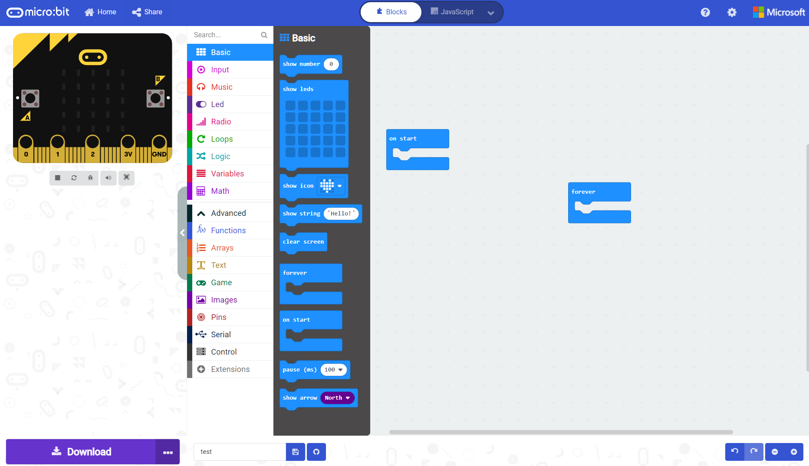

There are 3 main sections to this layout: 

The emulator: 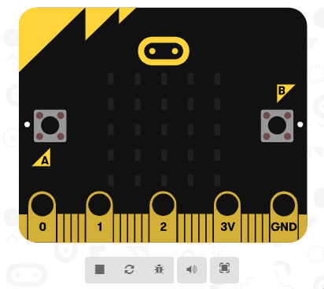

The command bars: 
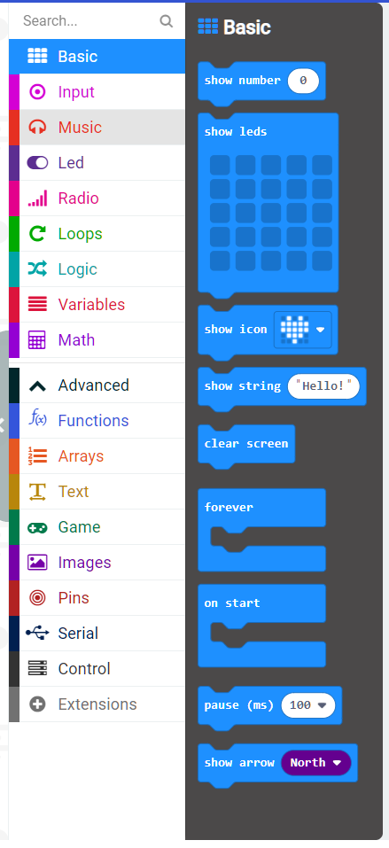

And your programming editor: 

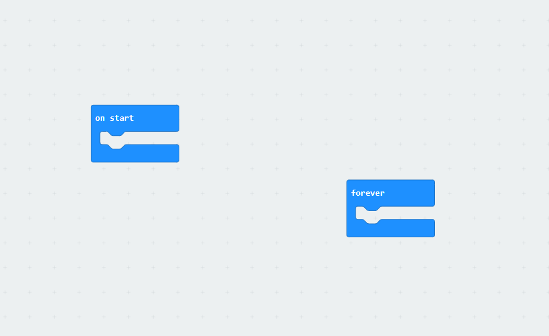

### Navigating the command bar

The micro:bit has a command bar that has all of the major functions and logical statements we need to build cool stuff. 

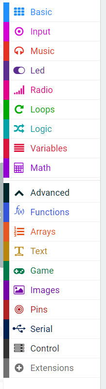

In here, we can select the building blocks for our programs. Click on basic to see some.

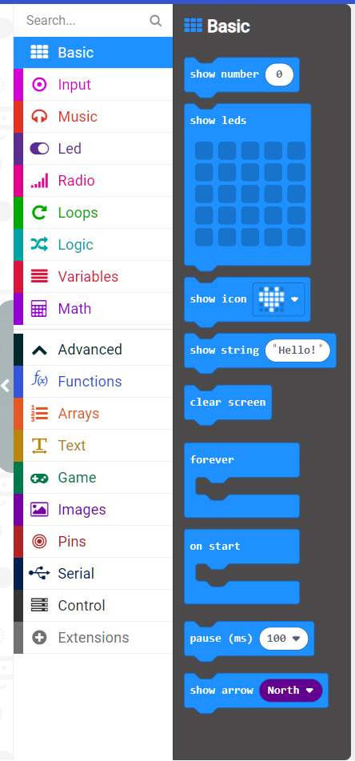

### Adding blocks to the screen

Let's try adding a block to the screen. Look down at the bottom of the basic screen. You will see the show arrow button Click and drag it into the the "on start hat". When you see the yellow highlight on both sides, you can let go of the mouse. 

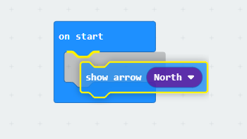

### On Start and forever

What's the difference between "On Start" and forever? 

On start only happens once when the micro:bit powers up. It's a good place to set up cool robot stuff. 

The forever hat just keeps on going around and around. 

Why hats? It's a legacy name from early visual programming because it kind of looked like a hat sitting on code. A very silly hat though. 

### Show Icon

The most fun basic block is, I think, the show icon block. 

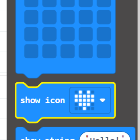

It's pretty funky. If you drop it into the forever loop you'll see that it draws a heart on the micro:bit. 

We can also draw other shapes: 

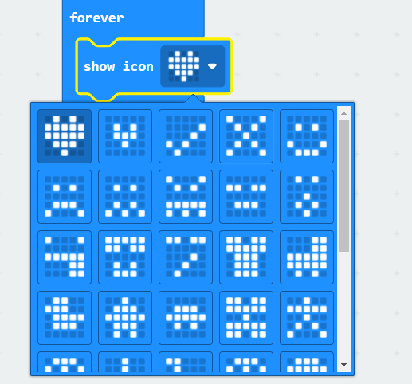

**practice**

Can you remember out how to change shapes? Try making the micro:bit emulator happy, sad, and then angry. 

### Pause

Another really important command in the basic blocks is pause. 

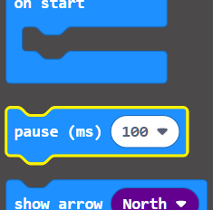

Pause stops the micro:bit for however long you tell it too. The time defaults to millisecond. A millisecond is 1/1000th of a second. 

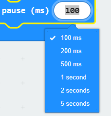

This means that 500 ms is 1/2 a second. It also means that 2 seconds is 2,000 milliseconds. 

**practice**

Using what we've learnt with show icon and pause means we can make a little animated story. Can you make a little animated story using the show icon block? 

### Show LEDs

What happens when we want to create our own shape? Well, we can! We can use the "show leds" block. 

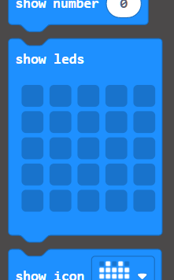

To active individual LEDs all you need to do is switch them on. If you switch the wrong one on, you can always switch them off! 

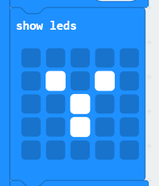

### Show String

We can also make our micro:bit talk to us using the "show string" block. 

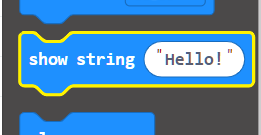

Grab it, and throw it into your forever hat. 
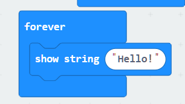

To change what it says, just change the word

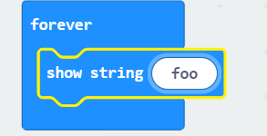

**practice**

Can you make it so your microbit says "Hello, Harry. I am pleased to see you!" and then do a short animation showing how happy it is? 

### Serial

A more advanced way of getting micro:bits talking to us is to use the serial commands. Unlike the basic blocks, we can only simulate this at the moment, but later we can use it to our fullest. But we can play with it today: 

In the command bars, click down on the advanced blocks. 

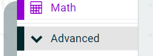

Then click serial

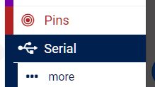

Today, we are only going to use the "serial write line" block: 

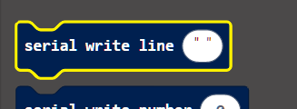

Drag that into the forever loop

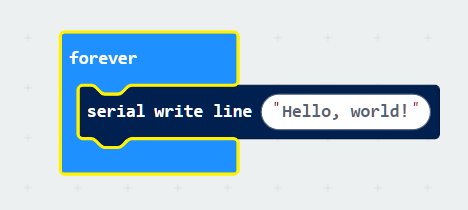

To see it printing, go back to the emulator and click the show console simulator

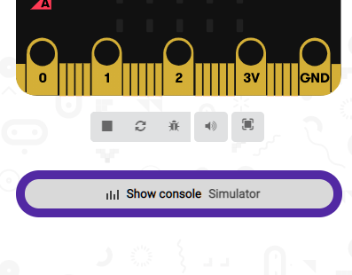

You can see it printing "Hello, world!" over and over again. 

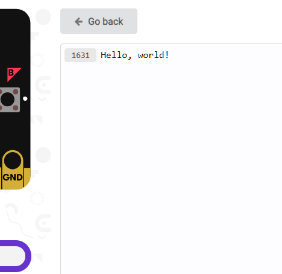

In fact, in the image above you can see it got to 1,633!

**practice**

Press the go back button. Try changing the string that you are writing from hello world to hello harry. 

Can you make it so asks you how your day is but do so on a second serial write line? 

## Challenge

I think it's time we practice our talents as a rapper! Write a short (silly) rap with each line of the rap being it's own serial write line. 

Challenge mode: Can you make it so the microbit pauses long enough for you to say each line? 

Extra tough challenge mode: Can you make a little animation at the start of the rap? 

