# Physical Computing

## Introduction

This semester our focus is on designing and building completely new things. Things that we can't just go up to a store and buy. 

## Requirements

We will need a few components to make this work: 

### Micro:bit

First up, we are going to need a micro:bit
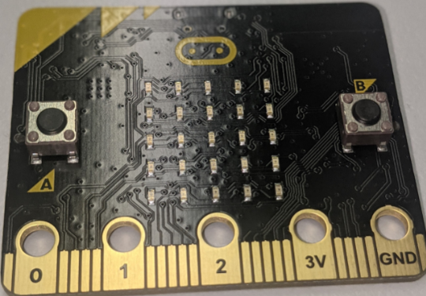

### Micro:bit prototype board connector

Something new in our mix is a connector for our micro:bit that allows us to connect our micro:bit to a breadboard or prototyping board. 

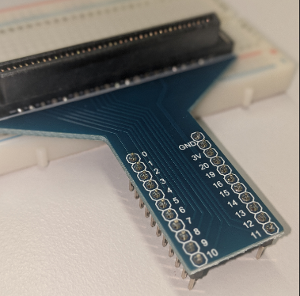

### Prototyping board

Prototyping boards allow us to connect components together without soldering or making full blown circuits. 

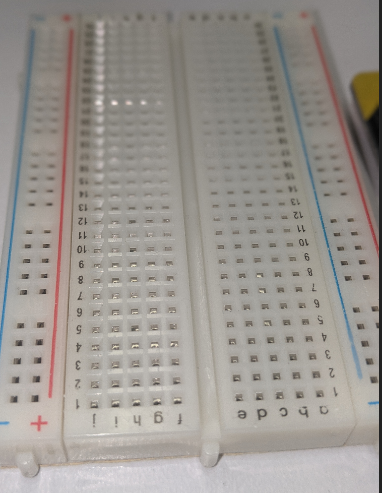

Essentially, breadboards are strips of metal that allow us to make connections

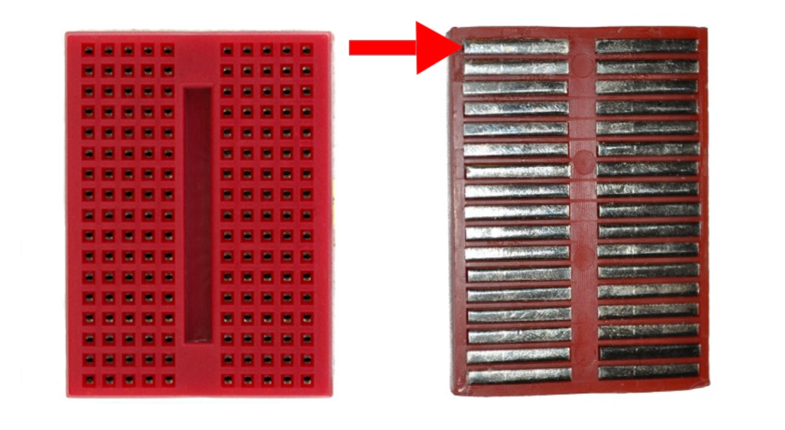

### LED 

LEDs are little lights that we can turn on or off. 

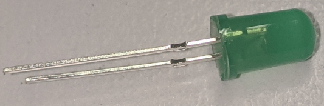

### Jump cables (red and black)

Jump cables allow us to plug into prototype boards to make a connection

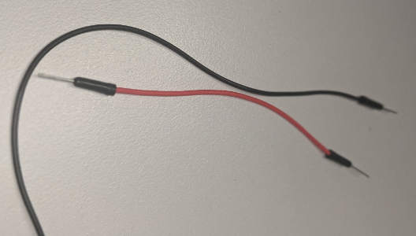

### 220ohm resistor 
LEDs can only take 2.4 volts of power. Micro:bits deliver 5 volts. We use resistors to limit the flow of electricity to the LED to protect it. 

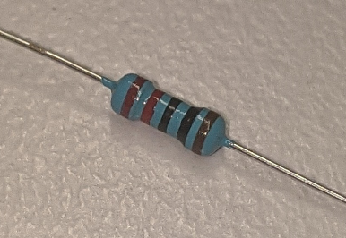

### Code design

The goal for this worked example is to turn an LED on and then turn it off. With each on/off change having a pause for 100 ms

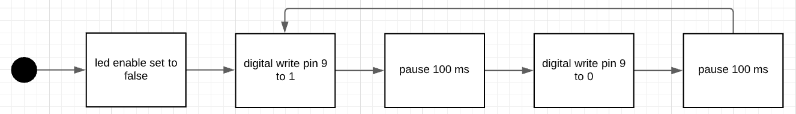

### Code

Eventually, this is what our code is going to look like. 

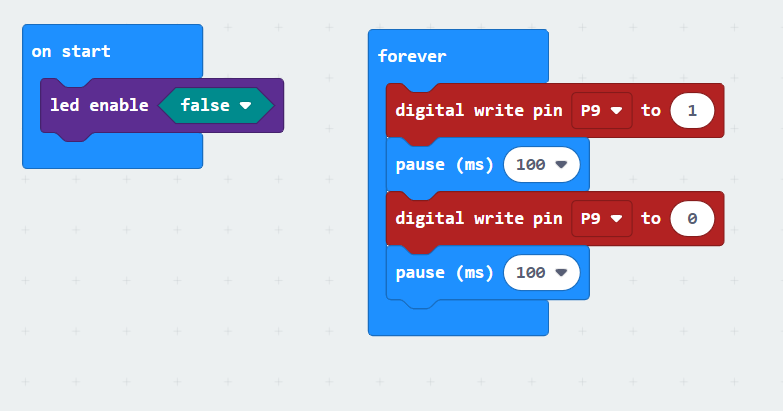

### Circuit Diagram

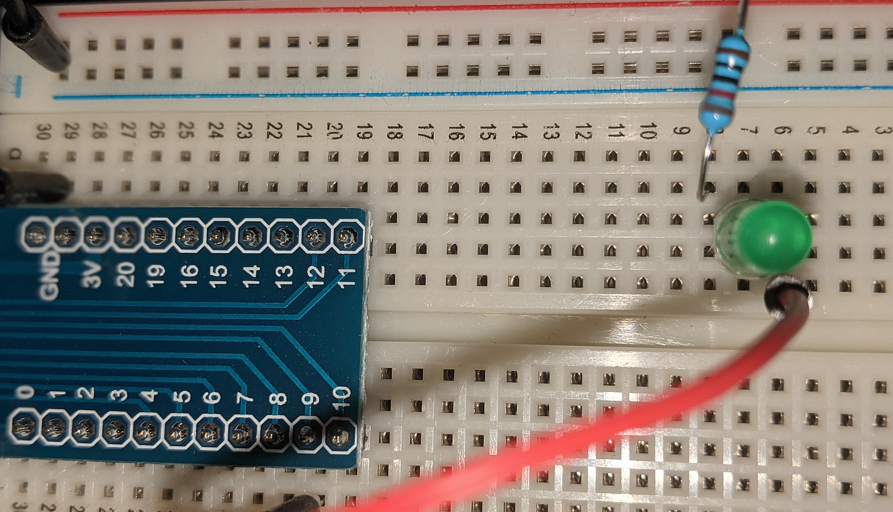

## instructions

### Digital Write 

Micro:bits give us the ability to power pins and read the power status of pins individually. This is called "digital write" and "digital read". Today we are going to use the digital write block. 

To find digital write, click advance

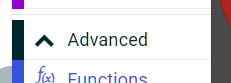

scroll down and find Pins

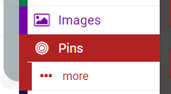

Inside the Pins section we can see the digital write block 

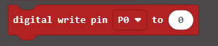

Let's make some code that allows us to turn a pin on if we press the A button and turn it off when we press the B button (in the simulator)

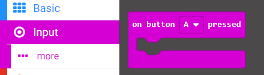

Go back to Pins digital write. Set the pin to 9 and select 1 on one Button Press and select 0 on the other. 

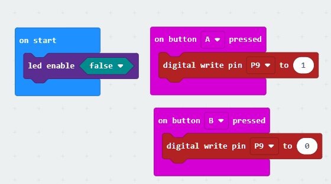

## Program Blinking Light

Save this project and make a new one called Blinking Light. 

We are going to make the following program. 

This diagram says that we are going to set the LED ENABLE to false. This turns off the LED on the Micro:bit and allows us to use the pins for our own devices. 

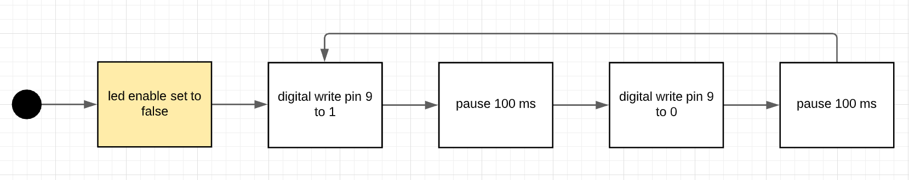

We can do this with the following code. (LED ENABLE is in LED -> Show more)

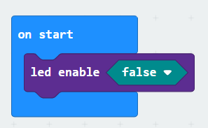

The next stage is to set digital write on pin 9 to 1 (ON). 
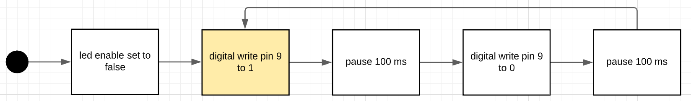
We can do this by selected Advanced -> Pins -> digital write pin (p9) to 1

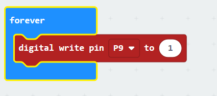

Now we want the program to pause for a while. So we can see it turn on. 
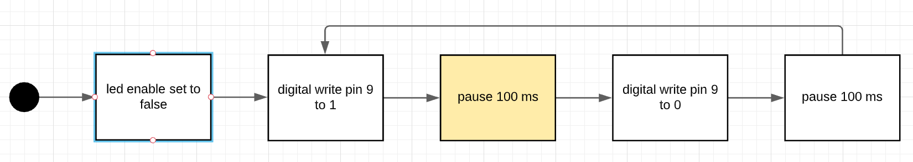

We can go back to our old faithful Basic -> Pause(100ms)
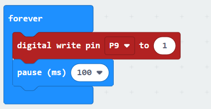

Next we are going to turn the LED off. 
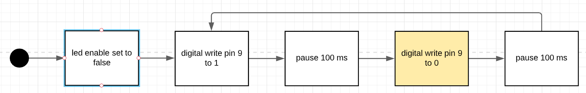

We can do that by going back to Advanced -> Pins -> digital write P9 0
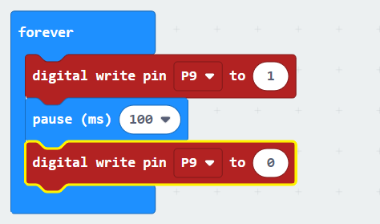

Now, we want to pause the program so we can see it turns off. 
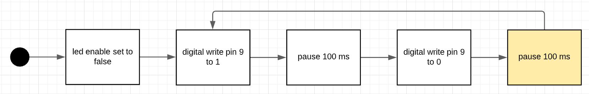

Again we can do that through Basic -> pause (100ms)
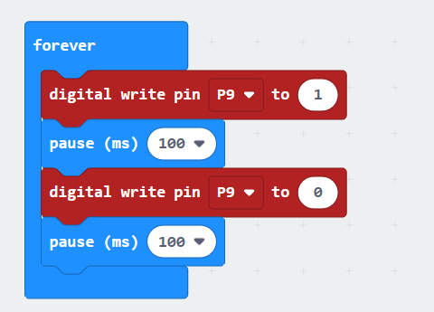

Now, because we are in a forever loop, this will happen forever!
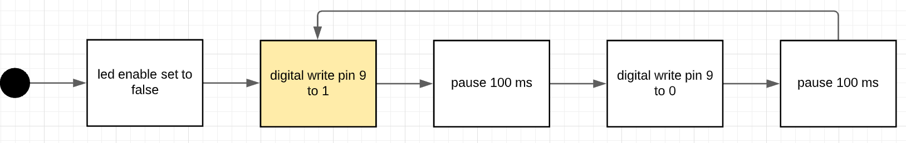

## Challenge

Your challenge is to make two blinking lights. On on Pin 9 and one on Pin 10. You want to make it so if P9 is on, then P10 is off and if P10 is on then P9 is off. 