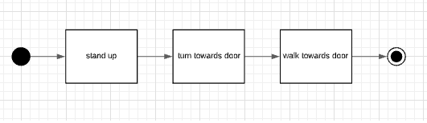
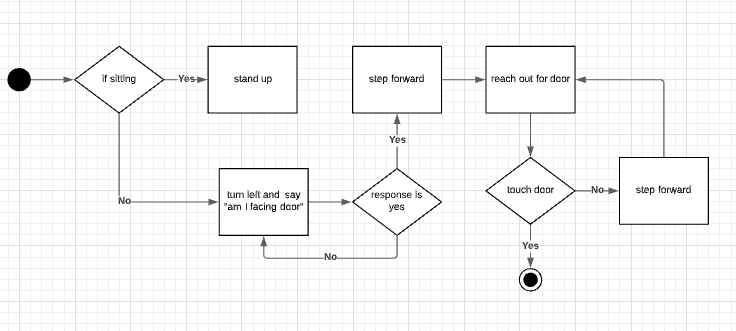
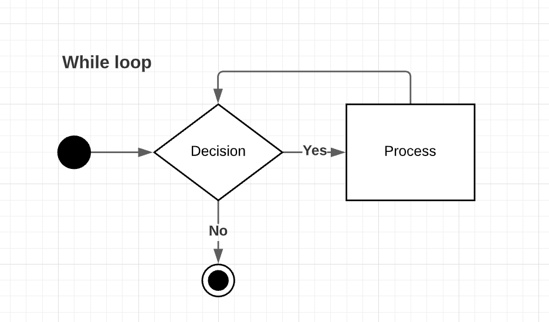

# Boxes and Arrows problems
## Introduction

How do software developers solve hugely complex problems? Do you think that they know everything to do with computers and programmer? Can Google answer all of your questions? 

The reality is that programming problems will likely become too complicated to solve just by looking at it. It's a common trap for novice programmers to stop the moment that they can't see an immediate solution to a problem. That is not a sustainable process. 

So, what can we do about it?
How do you solve a complex problem? You break up the complex problem into chunks. Often those chunks can be smaller problems. 

## Boxes and Processes

What are the boxes that we need to learn? Well, we probably only need to use simple boxes at the beginning of this—these boxes represent chunks, subproblems, conceptual steps, or whatever. 

How can we use boxes to describe ? 

The solid black dot tells us where a process starts, and the dot with a circle line around it tells us where a process ends.

## Making decisions
How do we represent a decision with boxes and arrows? Diamonds represent a decision point. Let's expand our problem to include a decision regarding . 

## What can we do with that? 

Additionally, we can use processes to describe doing  

## What if you can't solve the chunk you've identified 

Keep on drilling

## Worked example
Let's expand the problem to something that most of you haven't done before and see if it works (check google classrooms for video)

## Practice

Make process models for the following problems

* How should someone make the perfect (For you) cup of tea? 
* How should someone make make a cup of tea for someone else? 

## Challenge: The human robot

Creating a process model to solve the following problem: 

*By what rules can someone navigate from anywhere in B09 and get to the front office with their eyes closed?*

**Constraints** 

* The victim ... err subject is required to keep their eyes closed
* You must keep them safe. 
* They can use their bodies as sensors - but how can you tell them what to do? 
* You can't give instructions that don't exist on your process model 

**Requirements for submission**

* a diagrammatic process model that could explain the process
* the diagram could be in lucid charts (which is what I use) or on paper. Photograph this and upload it to google drive

**Recommended (optional)** 
* Find a partner (if you can't find a partner, I will be your partner). 
* Get your partner to follow your process diagram (yell it out to them because their eyes will be closed) 
* Modify your diagram based off of your observations 

"But I'm not comfortable pairing up!" That's fine. Are you comfortable watching other people run though theirs? You can use that to influence your diagrams. 