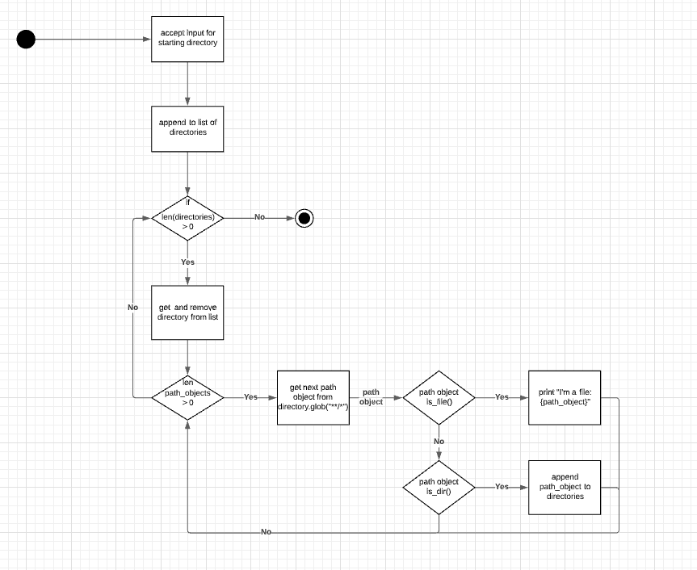

# Assignment Support T2

## Hashing Files 

Hashing files takes a little more work than reading strings. Because it is a file, we need to read it like a file. Remembering to set the read permissions to read binary mode (because it's a file not a text document).

```python
from pathlib import Path
from hashlib import md5, sha256

def make_hash(file_path, algorithm='md5'):
    """ creates either MD5 or SHA256 hashes from files
    
    This function takes the file_path of a file and creates a hash. The hash is selected as md5 as default but can be switched to SHA256 by using the algorithm keyword argument. 

    Parameters:
    file_path: a pathlib path of the file to be hashed
    algorithm: the type of algorithm to use for hashing. 

    Returns:
    Either an MD5 hash or a SHA256 hash of the given file.     
    """

    # selects MD5 by default. (is this optimum?)
    out = md5() 

    # if algorithm was sha256, switch to that. 
    if algorithm == 'sha256':
        out = sha256()

    # opens a file in read binary mode as file_reader
    with open(file_path, 'rb') as file_reader:
        # read a chunk of data from the file and assign it to byte
        while (byte := file_reader.read(out.block_size)):
            # update out with the chunk of data. 
            out.update(byte) 

    # return the hash as a hexdigest. 
    return out.hexdigest()

# Setting the directory to where hash objects are. 
my_file_directory = Path().cwd() / "2021/Digital Technologies - Digital Solutions/T2/hashing"

# hand crafting my dictionary. 
hash_objects = {
    'plane': my_file_directory / 'plane.jpg',
    'ship' : my_file_directory / 'ship.jpg'
}


#making a fancy print of my hash files
for key in hash_objects:
    ho = hash_objects[key]                         # assigning a common variable name because I am lazy
    print(f'Directory: {ho.parent}')               # path_object.parent is the directory without the file name
    print(f'File name: {hash_objects[key].name}')  # path_object.name is the name and extension
    print(f'hash: {make_hash(hash_objects[key])}') # hashing file
```

##  Directory Walking


```python
from pathlib import Path

# creating a list of directories starting with the current working directory
directories = [Path().cwd()]

def walk(directory_name):
    """ Walks through directories 
    Iterates through all child path objects including files and directories. 
    If the path object is a file, it prints it to standard output
    If the path object is a directory it adds it to the list of directories

    Parameters: The name of the directory to search through

    Returns: None
    """
    for path_object in directory_name.glob("*/*"):         # glob is a group of file objects 
        if path_object.is_file(): 
            print(f'Hey, {path_object} is a file!')
        elif path_object.is_dir():
            directories.append(path_object)
                

# while there are directories to loop through
while len(directories) > 0:
    # pop one from the list of directories
    directory = directories.pop(0)                          # pop returns and removes from a list
    walk(directory)                                         # let the walk directory handle it
```


## Making a command line program 


```python
"""
Checks to see if a file exists. 

Optional: Can print contents of file to standard output.
"""
from pathlib import Path
from argparse import ArgumentParser
parser = ArgumentParser()

# add a positional argument for the file name. 
parser.add_argument('file_name', help='recursively reads all of the files in directory and sub-directories and stores them to hashes')

# add an optional argument to see if we also want to print out the contents of the file name
parser.add_argument('-r', '--read', action="store_true", help='writes a file to standard outputS')

args = parser.parse_args()                    # parses all of the arguments 

file = Path().cwd() / args.file_name          # adds the filename for the current working directory

if args.read:                                 # if we have flagged read file, read. 
    with open(file) as fr:
        for line in fr:
            print(line, end='')
else:                                         # otherwise, print if the file is there or not. 
    if not file.is_file():
        print(f"{file} does not exist")
```