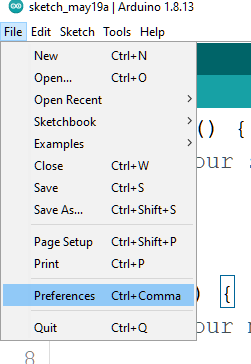

# Configuring the Arduino Client for ESP32 devices

## You will learn

## Configuring Arduino Client 

### Loading Arduino

### Add the Arduino ESP32 Repository 

`https://dl.espressif.com/dl/package_esp32_index.json`

### Install the boards

### Configure the Adafruit ESP32 Feather

## Topic 

### Detail

### Detail

### Detail

### Detail

## Topic 

### Detail

### Detail

### Detail

### Detail

## Challenges

### Intermediate Challenges

### Advanced Challenges