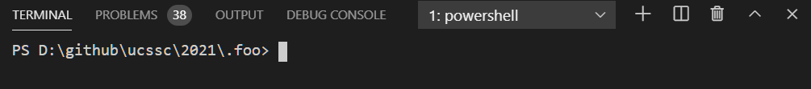
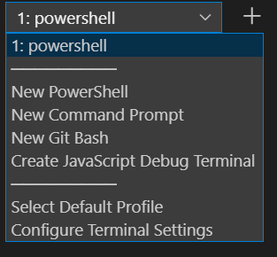
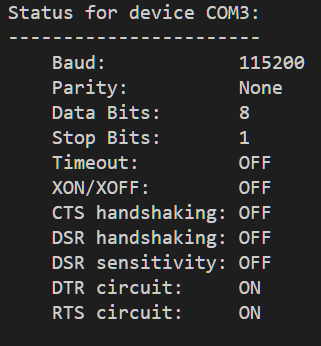
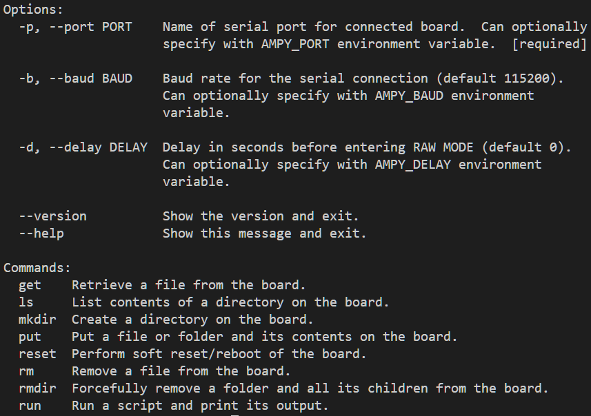

# Installing Micropython

## You will learn the following 
* How to install Micropython 
* How to upload a basic script via AMPY
* Know some basic file system commands
* How to clean directories on a Micropython device 
* Know what Visual Studio Code
* Know what Micropython is
* Know what AMPY is
* Understand how to prepare and maintain a micropython board and use it for simple scripts using Visual Studio Code and AMPY. 

## Installing Micropython
### Microcontrollers hello world
**short instructions:** 

1. Download esp32-idf4-20210202-v1.14.bin
2. Open Visual Studio Code
3. python -m pip install esptool 
4. type mode  
5. esptool.py --chip esp32 --port COM3 write_flash -z 0x1000 d:/github/esp32-idf4-20210202-v1.14.bin 
6. python -m pip install --user adafruit-ampy
7. ampy –help 
8. ampy -p COM3 ls 
9. ampy --port COM3 put blink.py main.py 

**Detailed instructions**   
You need to download the `esp32-idf4-20210202-v1.14.bin` binary file from google classrooms. You can find it under `Week 10: Installing Micropython`. You might download `blink.py` as well. 

Open up Visual Studio Code. Once VSC is open, look at the bottom of the screen. You should be able to see the terminal/problems/output/debug-console window. 



Click on Terminal and change the terminal type to PowerShell. 



In the console type `python -m pip install esptool`

**What is esptool?** esptool is a command line utility that allows for easy communication with READ ONLY MEMORY bootloaders in ESP32 Microcontrollers (that's what the Huzzah is). It allows us to flash firmware, reading back firmware, querying chip parameters, and etc. 

**What is firmware?** Firmware is data that is stored on a computer or other hardware device's ROM (read-only memory) that provides instruction on how that device should operate.

Locating what COM Port the Huzzah is on. 
in the PS Terminal window, type `mode`
What is mode? mode displays system status, changes system settings, or reconfigures ports and devices. If used without parameters, mode displays all of the controllable attributes of the console and available COM devices. 



Look for the device that has support for `Baud: 115200`. At home, this port is COM3. 


Use esptool.py to upload micropython to your Huzzah. 
`esptool.py --chip esp32 --port COM3 write_flash -z 0x1000 d:/github/esp32-idf4-20210202-v1.14.bin`

Note, my `esp32-idf4-20210202-v1.14.bin` was stored in my GitHub directory. You will need to change your directory so it matches where you have saved yours. 

Install AMPY 
`python -m pip install --user adafruit-ampy`

What is AMPY? MicroPython Tool (AMPY ) - Utility to interact with a CircuitPython or MicroPython board over a serial connection.

Ampy is meant to be a simple command-line tool to manipulate files and run code on a CircuitPython or MicroPython board over its serial connection. With AMPY, you can send files from your computer to the board's file system, download files from a board to your computer, and even send a Python script to a board to be executed.

Let's check AMPY's help file. Type `ampy --help` (note two -). We can see some very interesting things in here: 


 

Let's see what is on your board. Type `ampy --port COM3 ls`

## Uploading basic script
If you haven't already downloaded `blink.py` from google classrooms and save it somewhere, it makes sense. 

In your PS Terminal window, type `ls`. 

```
PS D:\github\ucssc\2021\.foo> ampy --port COM3 ls
/boot.py
/main.py
```

Move your file into whatever this directory is `ampy --port COM3 put blink.py main.py`

I've moved it onto the Huzzah with the name main.py (blinky.py becomes main.py)

Your board should be blinking on and off 10 times. 

## Cleaning/maintaining Micropython devices 
Sometimes you will want to delete files on your Board. Let's delete main.py. `ampy -p COM3 rm main.py` 
`rm` means remove

Let's check to see if that worked: `ampy -p COM3 ls` shows 
```
PS D:\github\ucssc\2021\.foo> ampy -p COM3 ls        
/boot.p
```
Okay, let's put it back: 
`ampy -p COM3 put blink.py main.py`

## What is Micropython, and how does it differ from Python
MicroPython is a tiny open-source Python programming language interpreter that runs on small embedded development boards.  With MicroPython, you can write clean and simple Python code to control hardware instead of using complex low-level languages like C or C++ (Arduino uses C/C++ for programming).

## Challenges
To help build your understanding of micropython, ampy, and microcontrollers, you will be issued with 3 challenges, two simple and 1 intermediate. Keep all of these files safe. 
### Simple Challenges
1. Copy the blink.py and name it rapid_blinking.py. Modify this script so it will blink on and off with 0.2 second delays. 
2. Copy the rapid_blnking.py file and name it lots_of_rapid_blinking.py. Modify this script so that it will blink on and off 100 times. 
### Intermediate Challenge
3. Copy blink.py and name it morse_what.py. Modify this script so it will write your name in Morse code. 


