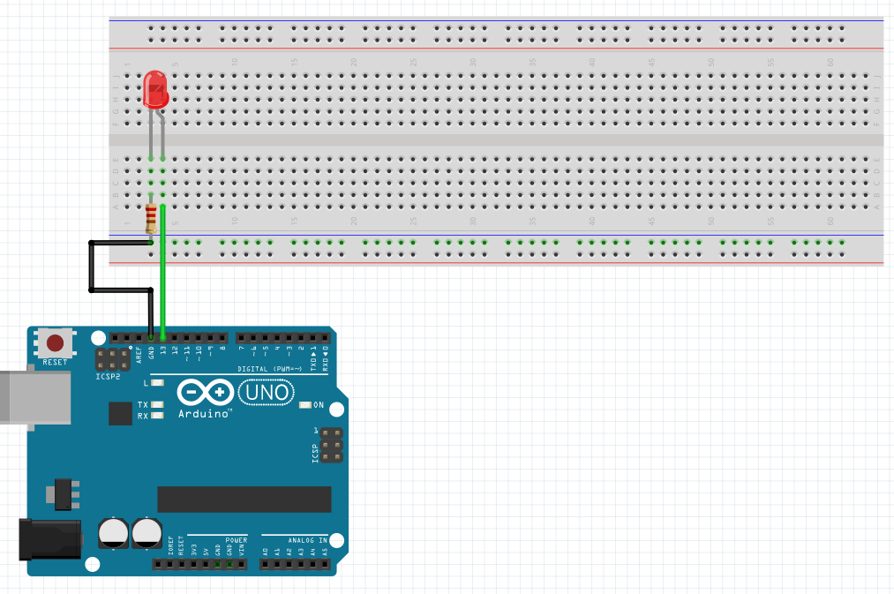
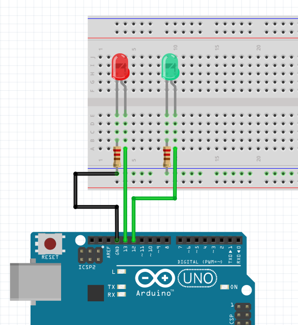
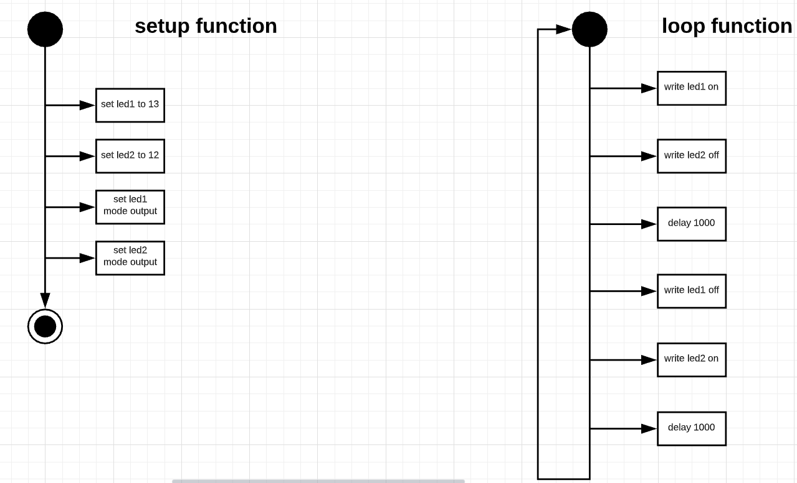

# Actuators and Basic Arduino

## You will learn
* Gain an initial awareness of the Arduino Ecosystem
* Build a basic system
* Gain knowledge of simple sensors by using a push button
* Understand how to use push buttons to create simple systems
* Gain knowledge on how to read digital data
* Understand how to accept that data in simple systems. 
* Gain knowledge of how simple conditions work

## Dictionary and Literacy Corner

Nobody would deny that having strong literacy skills is important for almost every part of life. The same is true in technical subjects: sharing a common technical literacy makes it easier for professionals to talk to each other.

What do the following terms mean. Create a word document and copy and paste these terms and what they mean. You might need to look up google
Words:
* Push-button 
* Arduino
* USB
* Jump Cable/Wire
* LED
* actuator
* sensor

Code: 
* `Serial.begin(9600);`
* `Serial.println(“stuff”);`
* `Serial.print(“cheeky”);`
* `digitalRead(pin);`
* `pinMode(13);`   
* `LED_BUILTIN` 
* `digitalWrite(13, LOW);` 
* `HIGH` 
* `LOW` 
* `delay(1000) `
* `void setup(){ … }; `
* `void loop() {...};` 
* `//`
* `/* … */`
* `int blinkPin;`
* `int blinkPin = 10;`

In Arduino C what do the following characters represent. 
* The semicolon ; key
* Double quotes “
* Single quotes ‘
* Curly braces/brackets { and }
* Braces ( and )
* What is the difference between = and == 

## Blinking LED 

Plug in! 


```cpp
int led;
void setup() {
  led = 13;
  pinMode(led, OUTPUT);
}

void loop() {
  digitalWrite(led, HIGH);
  delay(1000);
  digitalWrite(led, LOW);
  delay(2000);
}
```


## Blinking LED on board 



```cpp
int led;
void setup() {
  led = 13;
  pinMode(led, OUTPUT);
}

void loop() {
  digitalWrite(led, HIGH);
  delay(1000);
  digitalWrite(led, LOW);
  delay(2000);
}
```

## Challenges
When you complete a challenge, record it and save it to your google drive. Make sure you name it so you can remember it. 

### Blinking 2 LEDs




### Intermediate Challenges

Create a system that creates the Morse code for your full name. The quick tl;dr for Morse code timing is: 

* dot = 1 second
* dash = 3 seconds
* the space between dots and dashes of the same word is one second
* the space between words 
